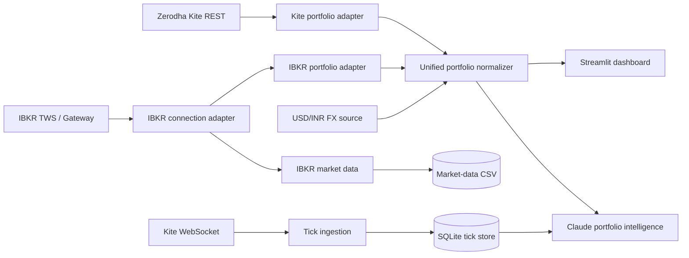

# Unified Broker Architecture

## System overview

The repository keeps broker-specific integration code behind adapters and normalizes positions into a common portfolio representation before the dashboard or AI layer consumes them.

## Reliability boundaries

### IBKR connection

`ibkr/auth.py` uses bounded exponential backoff for initial connection attempts. The backoff schedule lives in `unified/reliability.py`, making the retry policy deterministic and directly testable.

The current reconnect handler performs one delayed reconnect after an unexpected disconnect. This is intentionally bounded rather than an unending tight reconnect loop.

### Kite WebSocket

`kite/ticks.py` delegates transport reconnect behavior to `KiteTicker`, logs reconnect attempts, persists received ticks to SQLite, and closes the database cleanly when the stream stops.

### FX dependency

The USD/INR lookup has an explicit timeout and falls back to an environment-configured rate if the public FX endpoint is unavailable. This allows portfolio normalization to degrade predictably instead of failing the entire view.

### Local persistence

Tick data is written to SQLite and IBKR sampled prices are written to CSV. These paths are treated as runtime state and excluded from the container build context.

## Failure modes

| Dependency | Failure | Current behavior |
| --- | --- | --- |
| IBKR TWS/Gateway | connection refused / unavailable | bounded exponential retries, then explicit failure |
| IBKR live session | unexpected disconnect | logged delayed reconnect attempt |
| Kite WebSocket | transient transport drop | reconnect callback is logged; KiteTicker handles transport retry |
| FX API | timeout / HTTP / parse error | fallback `USD_INR_RATE` is used |
| Anthropic | unavailable / invalid API key | AI task fails independently of broker normalization |
| SQLite/CSV | local write error | surfaced to caller/logs rather than silently ignored |

## Quality gates

Pull requests now validate:

- Python 3.10, 3.11, and 3.12
- deterministic unit tests for normalization, FX fallback, and retry policy
- coverage floor for the broker-neutral `unified` layer
- Ruff checks for new reliability/test code
- production Streamlit container build

The broker-neutral logic is deliberately the easiest part to test without live financial credentials; live broker integration remains dependent on external Kite/IBKR sessions.
